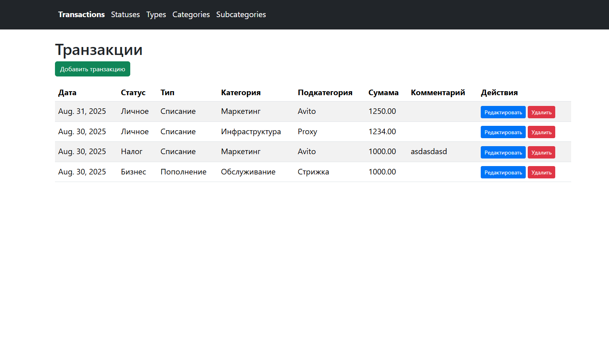
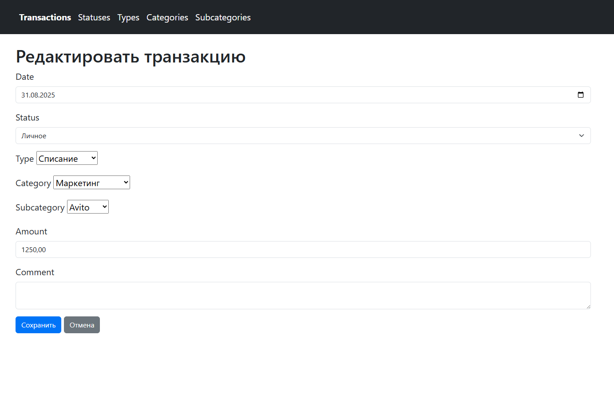

# Cash Flow Manager (Django Project)

Веб-приложение для учёта транзакций с поддержкой справочников (типы транзакций, категории, подкатегории, статусы).  
Реализована возможность создавать, редактировать и удалять записи через удобный интерфейс.

---

## 🚀 Возможности
- Управление транзакциями:
  - добавление, редактирование, удаление;
  - динамическая подгрузка категорий и подкатегорий в форме;
- Управление справочниками:
  - типы транзакций;
  - категории и подкатегории;
  - статусы транзакций;
- Защита от удаления связанных объектов (`on_delete=PROTECT`);
- Удобный UI на Bootstrap.

---

## 🛠️ Технологии
- Python 3.12.1
- Django 5.2.5
- Bootstrap 5
- SQLite 

---

## 📦 Установка и запуск

1. Клонируйте репозиторий:
```bash
git clone https://github.com/iMadHyper/cash-flow-manager.git
cd cash-flow-manager
```

2. Создайте и активируйте виртуальное окружени
```bash
python -m venv venv
source venv/bin/activate   # Linux/Mac
venv\Scripts\activate      # Windows
```

3. Установите зависимости
```bash
pip install -r requirements.txt
```

4. Примените миграции
``` bash
python manage.py makemigrations
python manage.py migrate

5. Загрузите данные из фикстуры (Опционально)
```bash
python manage.py loaddata core/fixtures/initial_data.json
```

6. Запустите сервер
```bash
python manage.py runserver
```

Перейти на: http://127.0.0.1:8000/


## 📷 Демонстрация



